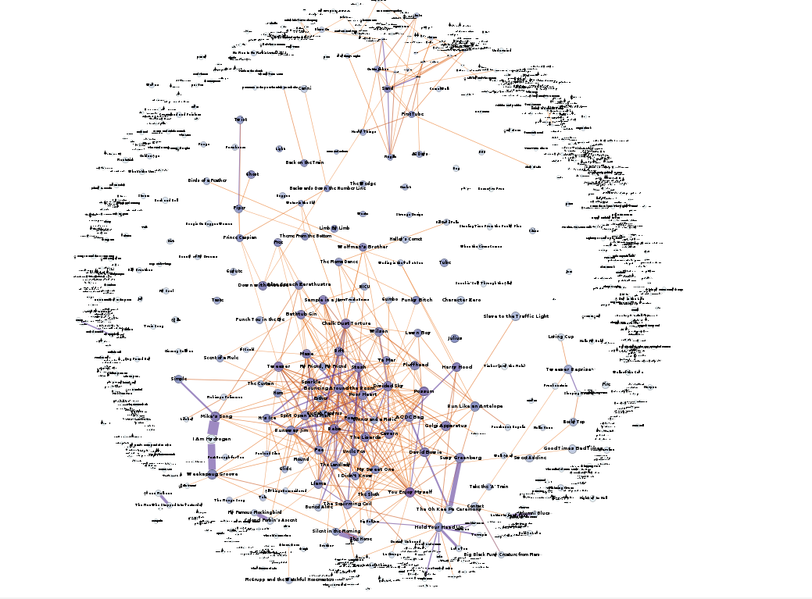
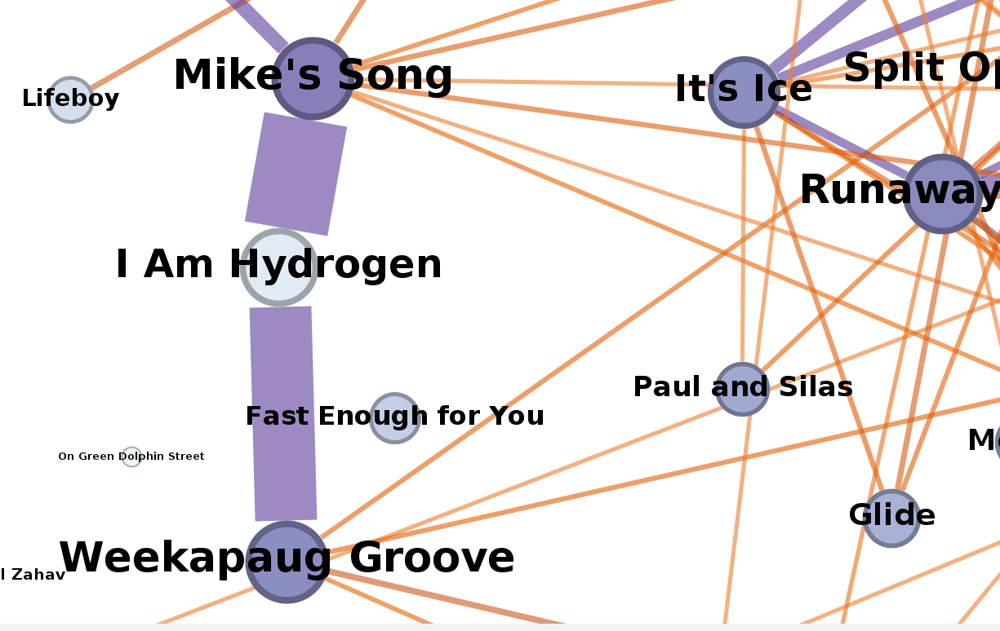
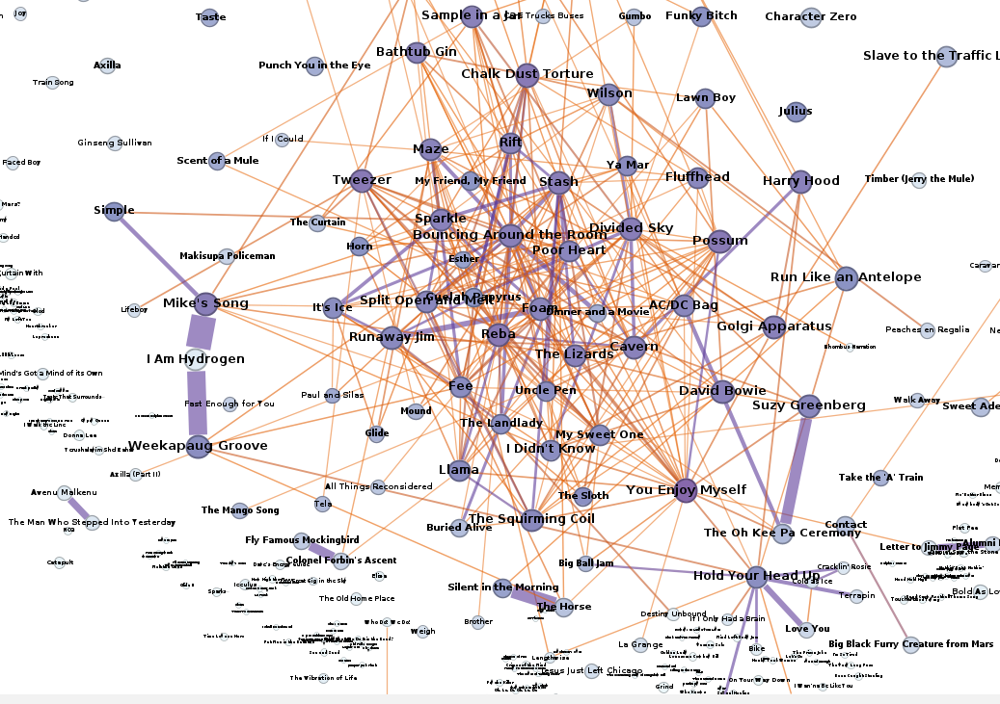
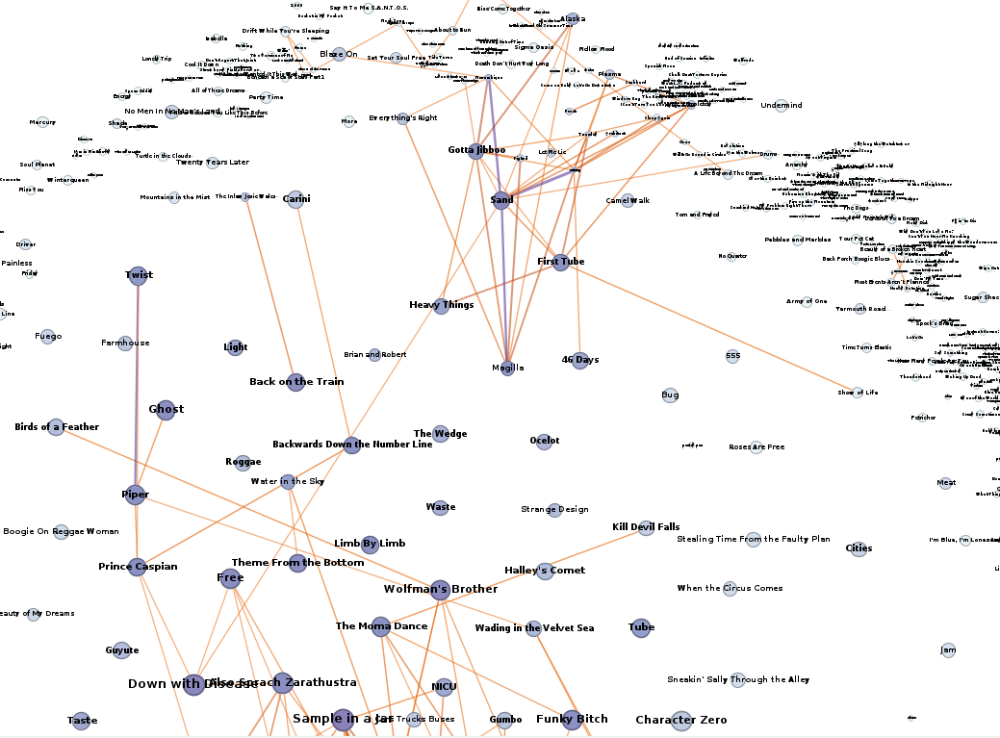
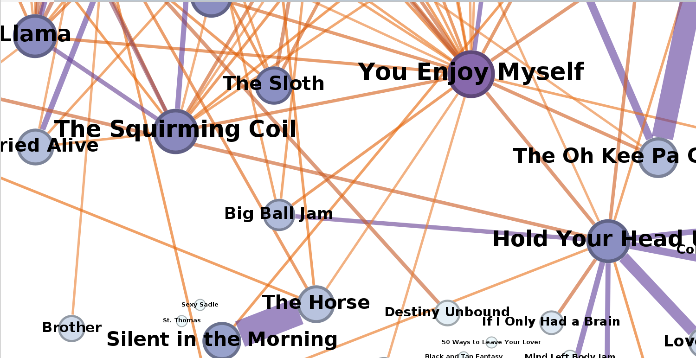

# Phish Song Network Analysis

## Overview

The band [Phish](https://en.wikipedia.org/wiki/Phish) is an immensely popular jam band from Vermont who have been playing together since 1984 with only a few brief disruptions. The band typically plays a 3 to 4 hours show composed of a first set, a second set, and a small encore set. No two shows are alike! Jam bands are improvisational, similar to Jazz, and so the band goes into every show with only a very loose idea of what songs they might play - they proceed to then make it up as they go.

Thankfully, back in their early days some really cool statistician phans (self-identified fans of the band) decided to log statistics for each show the band played, including the order and timings of songs played, song debuts, and gaps since they were last played. https://phish.net tracks all of these data and makes them available through their website and api. The recordkeeping of these statistics throughout the bands rise in popularity is treasured by the Phish community. 

Since their inception, the band has 937 distinct songs (including originals and covers). They have played 324 original songs! Certain songs are naturally more popular than others, while other songs might serve a certain "role" within a set (IE opener, closer, transitional, etc...). Some songs are also only played in certain sequences with other songs. Trying to guess the song order (or the next song) is a common game phans play amongst themselves at shows.

## Data Preparation

For this weeks Network of the Week, I decided to hit the phish.net/api to explore the associations between different songs using `networkx` and `Gephi`! To prepare the data each setlist (ever played) was parsed through with this algorithm:
+ for each set in the setlist:
   + for each song in the set:
      + get the IDs of the song, the next song, and previous song to form (up to) two ID pairs:
         + current song + next song
         + current song + previous song
      + increment the adjacency matrix of at the indices specified by each song ID pairs. This makes the weights of each song association link as the sum of the associations in all shows.

Once the adjacency matrix was formed, it was made into a networkx graph and song attributes were added as node attributes and exported as a `.gexf` file for Gephi.

## Analysis

The Graph:

Some descriptions of the first graph:
+ Nodes are songs
   + the size indicates the song's popularity
   + the color indicates degree (darker nodes have higher degree)
+ The Links indicate songs which are often associated together in a given set
   + in this case, association is defined as songs played directly in sequence
   + these are undirected links to associate songs played both before and after one another. (songs have directed relationships in reality, but the graph was left undirected for simplicity sake....)
   + the link size and color represent the link weights - songs that are often associated in a given set are weighted heavier
   + only links are shown between songs which have been associated (sequenced together) in at least 10 shows.
+ Some Graph Stats:
   + Avg. Degree: 0.82
   + Avg. Weighted Degree: 15.4
   + Network Diameter: 9
   + Avg. Clustering Coefficient: 0.18
   + Avg. Path Length: 3.7

Some other interesting structural observations below.....

### Mike's Sequencing Groove

Mike's Song --> I am Hydrogen --> Weekapaug Groove is an absolute classic! Sometimes I am Hydrogen is replaced by other songs, but it almost exclusively played in association with the other two when it is played. Other exclusive (or near-exclusive) song pairs include Colonol Forbin's Ascent --> Fly Famous Mockingbird, The Horse --> Silent in the Morning, Swept Away --> Steep (one of my *favorites*!), and Avenu Malkenu --> The Man who Stepped into Yesterday --> Avenu Malkenu.

### Gamehendge Supercluster 

There is a super cluster of the most popularly played songs, also some of the oldest. Many of these are also interconnected as part of the universe of Gamehendge - a fictional universe whose story is told through the self-titled concept album.

### Sand Cluster

Interestingly, there is a smaller cluster of songs centered around Sand, Gotta Jibboo, and First Tube. This suggests that while there is a core group of songs that are often played together, setlists with Sand/Gotta Jibboo/First Tube have their own distinctive style compared to the main group.

Here you can also see an "asteroid belt" of songs which are usually either:
+ new - so they haven't had much time to associate yet
+ one-off covers that won't likely be repeated ever again
+ unpopular / deprecated songs

There are a number of semi-popular songs in the interior which aren't played enough to breach the floor of 10 associations with a single other song.

### Hold Your Head Up

Hold Your Head Up is a song which is often played twice in succession sandwiching another song. Usually the sandwiched song involves the band singing barbershop, playing an Electrolux vacuum cleaner, or dancing on top of the grand piano!  Because of the duplicative relationship it has with its other songs, links sourced from it are weighted heavily. Avenu Malkenu --> The Man who Stepped into Yesterday --> Avenu Malkenu is another example of this. 

--- 

## Conclusion

I hope you were able to learn something about Phish! They are a wonderful band, and often play at the Amphitheatre in Noblesville, Indiana if you are ever interested in checking them out. Live recordings of all their shows can be streamed from http://phish.in/ or torrented on https://etree.org (this is legal as the Band condones non-commercial recording of all their shows).

See my [github](https://github.com/greenmmq/PhishSongNetwork) for the `py` code to build the graph and the `.gexf` file of the graph for you to explore more on your own. 

---

Other really interesting Network of the Week alternatives to phish song graph are:

+ Worldwide Railroad Map - https://www.openrailwaymap.org/
+ Neural Network Graphs - https://www.asimovinstitute.org/neural-network-zoo/
+ Linux Kernel Hierarchy - https://makelinux.github.io/kernel/map/intro

